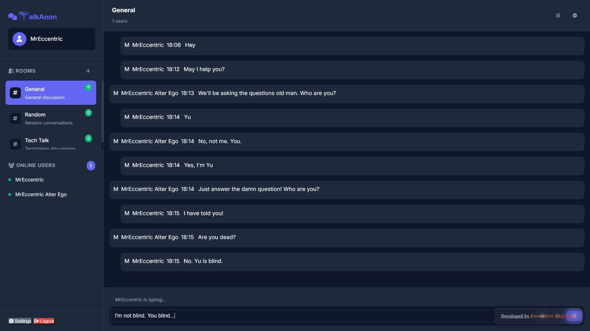

<div align="center"></div>

# <div align="center">TALKANON</div>

**TalkAnon** is a full-stack, anonymous chatroom hub designed to provide a real-time, engaging, and customisable experience for users. It is a web-based application focused on a clean, modern UI and seamless real-time communication.

---

## 🚀 Live Demo

Experience TalkAnon live here: 
👉 [](https://theeccentriccoder.github.io/TalkAnon)

 <div align="center">
 <p>

[](https://github.com/ellerbrock/open-source-badges/)


 </p>
 </div>

## 📸 Screenshots

<div align="center"></div>

---

### 💡 Core Chat Functionality

* **Anonymous Usernames**: Users can join the chat by providing a simple username. The server tracks each user with a unique ID based on their socket connection.
* **Real-time Messaging**: Messages are sent and received in real-time, instantly appearing in the chatroom for all participants.
* **Multiple Chatrooms**: The application supports multiple chatrooms, starting with three default rooms (`General`, `Random`, `Tech`). Users can also create their own new rooms dynamically.
* **Message History**: Messages are stored on the server, and the chat history for a room is automatically loaded when a user joins or switches to that room.
* **User and Room Synchronization**: The list of online users and available rooms is synced across all clients. When a user joins or leaves a room, the user count is updated in real-time.

### 🎨 User Interface & Experience

TalkAnon provides a visually rich and responsive user interface:

* **Responsive Design**: The entire layout is fully responsive, adapting seamlessly to desktop, tablet, and mobile devices.
* **Modern and Clean UI**: The application features a clean, card-based design with smooth animations and a consistent color palette.
* **Modal-based Workflow**: Key interactions like logging in, creating rooms, and accessing settings are handled via unobtrusive modals.
* **User Notifications**: The application provides toast notifications for key events like successful login, connection errors, and room creation.
* **Automatic Scrolling**: The message area automatically scrolls to the bottom when new messages are added, ensuring users always see the latest content.

### ⭐ Stand-out Features

* **Comprehensive Message Formatting**: The chat supports a variety of text formatting options, including:
    * **Bold text**: Using `**text**`.
    * **Italic text**: Using `*text*`.
    * **Links**: Automatically converts URLs into clickable links.
    * **Code Blocks**: Supports both inline code using `` `code` `` and multi-line code blocks using ` ```code``` `.
* **Customizable Settings**: Users can personalize their experience through a settings menu, which includes a dark mode toggle, notification sound toggle, and timestamp toggle.
* **Emoji Support**: An emoji picker allows users to easily insert emojis into their messages.

---

## 🛠️ Technology Stack

TalkAnon is built using a modern and lightweight tech stack, focusing on real-time communication and a responsive user experience.


---

## ⚙️ Setup Instructions

To run TalkAnon locally, you will need Node.js installed.

### 1. Clone the Repository

```bash
git clone [https://github.com/theeccentriccoder/TalkAnon.git](https://github.com/theeccentriccoder/TalkAnon.git)
cd TalkAnon
````

### 2\. Install Dependencies

Install the required Node.js packages for the server:

```bash
npm install express socket.io cors
```

### 3\. Start the Server

Run the server file using Node.js:

```bash
node server.js
```
### 4\. Open the Frontend

With the server running, open the `index.htm` file in your web browser.

-----

## 🚧 Roadmap & Future Enhancements

  * [ ] **User Account System**: Implement user profiles to save quiz history, track statistics across sessions, and enable personalized settings.
  * [ ] **Enhanced Statistics**: Upgrade the statistics screen with advanced data visualizations (e.g., charts showing performance over time or by topic).
  * [ ] **Enhanced Social Features**: Add social sharing options for quiz results and the ability to challenge friends.
  * [ ] **Private Messaging**: Implement a private messaging feature for one-on-one conversations.
  * [ ] **User-Generated Content**: Explore the possibility of allowing users to create, share, and play custom quizzes.
  * [ ] **File/Image Sharing**: Add the ability to share files and images within chatrooms.
  * [ ] **End-to-End Encryption**: Implement end-to-end encryption for private chats to enhance security.

---

## Issue Creation ✴

Report bugs and issues or propose improvements through our GitHub repository's "Issues" tab.

## Contribution Guidelines 📑

- Firstly Star(⭐) the Repository
- Fork the Repository and create a new branch for any updates/changes/issue you are working on.
- Start Coding and do changes.
- Commit your changes
- Create a Pull Request which will be reviewed and suggestions would be added to improve it.
- Add Screenshots and updated website links to help us understand what changes is all about.

- Check the [CONTRIBUTING.md](CONTRIBUTING.md) for detailed steps...

## Contributing is fun🧡

We welcome all contributions and suggestions!
Whether it's a new feature, design improvement, or a bug fix - your voice matters 💜

Your insights are invaluable to us. Reach out to us team for any inquiries, feedback, or concerns.

## 📄 License

This project is open-source and available under the MIT License.

## 📞 Contact

Developed by [Eccentric Explorer](https://theeccentriccoder.github.io/Me)

Feel free to reach out with any questions or feedback\!
